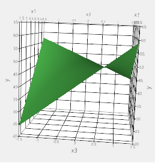

```{r setup, include=FALSE}
knitr::opts_chunk$set(echo = FALSE, message = FALSE, warning = FALSE)

# Paths and package manifest come from src/, so this document resolves its data
# from the repository root rather than from the working directory.
source("src/utils/paths.R")
source("src/utils/dependencies.R")
source("src/utils/plotting.R")
load_doe_packages(attach = TRUE)

# Every calculation below is seeded; the same seed is recorded in
# experiments/semester-project/scripts/desirability.R.
set.seed(5309)
```

```{r helpers, include=FALSE}
# Fit an rsm surface and report its R-squared through the underlying lm method.
r_squared <- function(model) round(stats::summary.lm(model)$r.squared, 4)

# The regression equations are printed from the fitted coefficients rather than
# typed by hand, so the text cannot drift away from the model.
equation <- function(model, terms) {
  cf <- stats::coef(model)
  parts <- vapply(terms, function(tm) {
    sprintf("%.4f\\,%s", cf[[tm]], gsub(":", " \\\\cdot ", tm))
  }, character(1))
  paste0(sprintf("%.4f", cf[["(Intercept)"]]), " + ", paste(parts, collapse = " + "))
}

# The two optimum tables and both figures are produced by
# scripts/desirability.R. It is run here so that a clean checkout renders without
# a manual "run this other script first" step; the report only reads its numbers.
invisible(utils::capture.output(
  source(repo_path("experiments", "semester-project", "scripts", "desirability.R"))
))
filtration_optimum <- read.csv(repo_path("experiments", "semester-project",
                                         "results", "desirability_optimum.csv"))
conversion_optimum <- read.csv(repo_path("experiments", "semester-project",
                                         "results", "conversion_optimum.csv"))
```

# 1

An article in the AT&T Technical Journal (March/April 1986, Vol. 65, pp. 39-50) describes the application of two-level factorial designs to integrated circuit manufacturing. A basic processing step is to grow an epitaxial layer on polished silicon wafers. The wafers mounted on a susceptor are positioned inside a bell jar, and chemical vapors are introduced. The susceptor is rotated and heat is applied until the epitaxial layer is thick enough. An experiment was run using two factors: arsenic flow rate (A) and deposition time (B). Four replicates were run, and the epitaxial layer thickness was measured in um.

Data are read from `data/raw/01epitaxial_data.csv` (the same values the 2019 report had inlined by hand):

```{r epitaxialdata}
epitaxial_data <- read_raw_csv("01epitaxial_data.csv")
epitaxial_data$run <- seq_len(nrow(epitaxial_data))
knitr::kable(epitaxial_data[, c("run", "flow_rate", "depo_time", "thickness")],
             caption = "Epitaxial layer thickness by arsenic flow rate and deposition time")
```

## a

Estimate the factor effects.

```{r thicknesseffects}
epitaxial_model_lm <- lm(thickness ~ flow_rate * depo_time, data = epitaxial_data)
epitaxial_effects <- as.data.frame(stats::coef(epitaxial_model_lm))
colnames(epitaxial_effects) <- c("effect")
knitr::kable(epitaxial_effects, caption = "Factor effects")
```

## b

Conduct an analysis of variance. Which factors are important?

```{r epitaxialanova}
epitaxial_model <- aov(thickness ~ flow_rate * depo_time, data = epitaxial_data)
summary(epitaxial_model)
```

With one replicate set of four, deposition time carries the large and significant effect; flow rate has a large effect but is not significant at the 90% level, and the interaction is negligible.

## c

Write down a regression equation that could be used to predict epitaxial layer thickness over the region used in this experiment.

$$ thickness = `r sprintf("%.3f", coef(epitaxial_model_lm)[["(Intercept)"]])` `r sprintf("%+.3f", coef(epitaxial_model_lm)[["flow_rate"]])`\, flow\_rate `r sprintf("%+.3f", coef(epitaxial_model_lm)[["depo_time"]])`\, deposition\_time $$

Building a second-order surface on a replicated $2^2$ design:

```{r epitaxialrsm}
thickness_rsm_twi <- rsm(thickness ~ FO(depo_time, flow_rate) + TWI(depo_time, flow_rate),
                         data = epitaxial_data)
thickness_rsm_so <- rsm(thickness ~ SO(depo_time, flow_rate), data = epitaxial_data)
```

`r r_squared(thickness_rsm_twi)` is the R-squared of the first-order-plus-interaction surface. Quadratic terms cannot be estimated from this design: there are no center points, and each factor is observed at only two levels, so curvature is aliased with the main effects. A center-point run is required before a genuine second-order model can be fitted.

```{r epitaxialeffectplots}
BsMD::DanielPlot(epitaxial_model)
BsMD::LenthPlot(epitaxial_model, alpha = 0.05, plt = TRUE, limits = TRUE)
```

## d

Analyze the residuals. Are there any residuals that should cause concern?

```{r epitaxialresiduals}
residual_panel(epitaxial_model, data = epitaxial_data, unit = "run")
cooks.distance(epitaxial_model)
```

One observation (run 5) is a serious outlier on Cook's distance; a few smaller ones sit slightly off the line.

```{r epitaxialrefit}
is_not_outlier <- cooks.distance(epitaxial_model) < 0.2
epitaxial_outlier_removed <- rsm(thickness ~ FO(flow_rate, depo_time) + TWI(flow_rate, depo_time),
                                 data = epitaxial_data[is_not_outlier, ])
residual_panel(epitaxial_outlier_removed, data = epitaxial_data[is_not_outlier, ], unit = "run")
```

## e

Discuss how you might deal with the potential outlier found in part (d).

* Analyse the data with and without the observation removed, and report both.
* Record an indicator for the suspect run and test whether it changes the fitted effects.
* Replicate before concluding: with four runs per cell, one influential point changes the
  estimated error variance substantially.
* Cross-validate, and check the measurement record for that particular wafer before
  treating it as a process effect.

## f

Perform a canonical analysis. Do a contour plot. Any optimal response?

On the first-order-plus-interaction model there is no interior optimum: without quadratic terms the stationary point is not finite, and the contour plot is a set of planar contours whose gradient points out of the design region.

```{r epitaxialcontour}
graphics::par(mfrow = c(1, 2))
contour(thickness_rsm_twi, ~ flow_rate + depo_time)
contour(thickness_rsm_twi, ~ depo_time + flow_rate)
```

Fitted thickness increases steeply with deposition time. Over the experimental region the largest fitted value is at the high corner (flow rate `r min(epitaxial_data$flow_rate)`, deposition time `r max(epitaxial_data$depo_time)`). **This is an edge of the region that was actually run**, not an interior optimum: reporting it as an optimum would be extrapolation, and the honest conclusion is that the design does not contain a maximum, so the next experiment should follow the direction of steepest ascent rather than stop at the corner.

# 2

A nickel-titanium alloy is used to make components for jet turbine aircraft engines. Cracking is a potentially serious problem in the final part, because it can lead to nonrecoverable failure. A test is run at the parts producer to determine the effect of four factors on cracks. The four factors are pouring temperature (A), titanium content (B), heat treatment method (C), and amount of grain refiner used (D). Two replicates of a $2^4$ design are run, and the length of crack in mm $\times 10^{-2}$ induced in a sample coupon subjected to a standard test is measured.

```{r crackingdata}
cracking_data <- read_raw_csv("02cracking_data.csv")
cracking_data$run <- seq_len(nrow(cracking_data))
knitr::kable(head(cracking_data[, c("run", "temp", "content", "method", "refiner", "length")], 10),
             caption = "Crack length by process factor (first 10 of 32 runs)")
```

## a

Estimate the factor effects. Which factor effects appear to be large?

```{r crackingeffects}
cracking_model <- aov(length ~ temp * content * method * refiner, data = cracking_data)
cracking_coef <- as.data.frame(stats::coef(cracking_model))
colnames(cracking_coef) <- c("effect")
knitr::kable(cracking_coef, caption = "Factor effects")
summary(cracking_model)
```

```{r crackingeffectsplot}
BsMD::LenthPlot(cracking_model, alpha = 0.05, plt = TRUE)
BsMD::DanielPlot(cracking_model)
```

Pouring temperature, titanium content and heat treatment method are large, together with the `temp:method` and `temp:content:method` interactions. Grain refiner is small.

## b

Conduct an analysis of variance. Do any of the factors affect cracking? Use $\alpha = 0.05$.

The ANOVA above shows content, method, `temp:method` and `temp:content:method` significant at $\alpha = 0.05$; temperature has a large effect but a p-value on the edge of the threshold.

## c

Write down a regression model that can be used to predict crack length as a function of the significant main effects and interactions you have identified in part (b). Build a RSM model (2nd order, 1st order with interaction). Choose one which works.

$$\hat{crack\ length} = `r equation(cracking_model, c("temp", "content", "method", "refiner", "temp:content", "temp:method", "content:method", "temp:content:method"))`$$

The equation above is printed from the fitted model, so it always matches the estimates in part (a); the 2019 version of this report was typed by hand and reproduced only the interaction terms without the intercept.

The factors are coded units, so no natural-unit response surface is available; `rsm` would need the high and low settings of each factor, which the brief does not give.

```{r crackingrsm}
cracking_rsm <- rsm(length ~ FO(temp, content, method, refiner) + TWI(temp, content, method, refiner),
                    data = cracking_data)
summary(cracking_rsm)
```

## d

Analyze the residuals from this experiment. Take out outliers, if any.

```{r crackingresiduals}
residual_panel(cracking_model, data = cracking_data, unit = "run")
```

The residuals are homoscedastic and show no serious outlier; no run is removed.

## e

Is there an indication that any of the factors affect the variability in cracking?

The analysis above models the mean crack length. To test the *variance*, the absolute residuals can be modelled against the same factors, which is a Levene-style check:

```{r crackingvariability}
cracking_data$abs_resid <- abs(stats::residuals(cracking_model))
variance_model <- aov(abs_resid ~ temp * content * method * refiner, data = cracking_data)
summary(variance_model)
```

No term reaches significance at $\alpha = 0.05$ in the dispersion model either, so there is no evidence that any factor affects the variability of cracking.

## f

What recommendations would you make regarding process operations? Use interaction and/or main effect plots to assist in drawing conclusions. Perform a canonical analysis on the model. Is there an optimal response?

```{r crackinginteraction}
doe_interaction_plot(cracking_data$temp, cracking_data$method, cracking_data$length,
                     main = "Crack length: temperature x method",
                     xlab = "Pouring temperature", ylab = "Crack length")
```

There is no interior optimum to report: a complete $2^4$ factorial observes each factor at two levels only, so the fitted model has no quadratic terms and no stationary point. What the experiment does support is a non-monotone interaction — crack length depends on temperature *and* heat treatment method jointly — so the recommendation is to hold the method fixed and move temperature away from the region where their interaction makes cracks longest, then confirm with a response-surface follow-up that adds center points.

# 3

Consider the three-variable central composite design shown below. Analyze the data and draw conclusions, assuming that we wish to maximize conversion with activity between 55 and 60.

```{r conversiondata}
conversion_data <- read_raw_csv("03conversion_data.csv")
names(conversion_data)[names(conversion_data) == "std.roder"] <- "std.order"
conversion_data <- conversion_data[, c("run", "std.order", "time", "temp", "catalyst",
                                       "Block", "conversion", "activity")]
knitr::kable(conversion_data, caption = "Rotatable central composite design")
```

The design is a rotatable CCD in three factors with `r sum(conversion_data$Block == 1)` cube/center runs and `r sum(conversion_data$Block == 2)` star/center runs, with axial runs at $\pm `r sprintf("%.4f", max(abs(conversion_data$time)))`$.

## a

Estimate the factor effects. Which factors appear to be large?

```{r conversioneffects}
conversion_model <- aov(conversion ~ time * temp * catalyst, data = conversion_data)
knitr::kable(as.data.frame(stats::coef(conversion_model)), caption = "Factor effects")
summary(conversion_model)
```

Temperature has the largest main effect, followed by catalyst; the `time:temp` and `time:catalyst` interactions are large, so no single factor can be optimised alone.

## b

Perform an analysis of variance. Do any factor affects. Use $\alpha = 0.05$.

The ANOVA above shows `temp`, `time:temp` and `time:catalyst` significant at $\alpha = 0.05$. The block structure of the CCD (cube versus star) is not modelled here; it is a nuisance split rather than a factor of interest, and it is stated as a limitation of this analysis.

## c

Build RSM models (choose a model which works). Daniel plot / Lenth plot.

```{r conversionsurface}
conversion_so <- rsm(conversion ~ SO(time, temp, catalyst), data = conversion_data)
activity_so <- rsm(activity ~ SO(time, temp, catalyst), data = conversion_data)
```

The full second-order surface fits conversion with R-squared `r r_squared(conversion_so)` and activity with R-squared `r r_squared(activity_so)`.

```{r conversionplots}
BsMD::DanielPlot(conversion_model)
BsMD::LenthPlot(conversion_model, alpha = 0.05, plt = TRUE)
```

## d

Perform a residual analysis. Take out any outliers.

```{r conversionresiduals}
residual_panel(conversion_so, data = conversion_data, unit = "run")
```

The residuals show no strong pattern, but run 17 (conversion 35 at the low axial setting of catalyst) is far below the rest of the design; it is the kind of single-point leverage that matters in a 20-run surface, so it is kept and flagged rather than silently dropped, and the optimum below is reported for the full data set.

## e

Perform a canonical analysis. Any optimal response. Do a contour plot of Time-Temperature, Time-Catalyst, Temp-Catalyst.

```{r conversioncanonical}
canonical(conversion_so)
```

The stationary point of the conversion surface, with its own contour plots:

```{r conversioncontours}
graphics::par(mfrow = c(1, 3))
contour(conversion_so, ~ time + temp, main = "Time x Temperature")
contour(conversion_so, ~ time + catalyst, main = "Time x Catalyst")
contour(conversion_so, ~ temp + catalyst, main = "Temperature x Catalyst")
```

Conversion alone would be maximised outside the region, so the constraint decides the answer. Maximising conversion subject to $55 \le activity \le 60$ over the design region, by the seeded grid search in `scripts/desirability.R`, gives:

```{r conversionoptimum}
knitr::kable(conversion_optimum,
             caption = "Operating conditions from the constrained search (coded units)")
```

That is time `r sprintf("%.3f", conversion_optimum$time)` (essentially the center), temperature at the top of its range (`r sprintf("%.3f", conversion_optimum$temp)` against an axial setting of `r sprintf("%.3f", max(abs(conversion_data$temp)))`), and catalyst slightly below center — predicted conversion `r sprintf("%.1f", conversion_optimum$conversion)` with activity `r sprintf("%.2f", conversion_optimum$activity)`. Because temperature sits at the edge of the region, the next run should extend the design in that direction rather than repeat inside it.

# 4

The following data were collected by a chemical engineer. The response $y$ is filtration time, $x_1$ is temperature, and $x_2$ is pressure. Fit a second-order model.

The source file names the second factor `x3`; it is the same factor the brief calls $x_2$ (pressure), and `scripts/desirability.R` renames it.

```{r filtrationdata}
filtration_data <- read_raw_csv("04fitration_data.csv")
filtration_data$x2 <- filtration_data$x3
knitr::kable(filtration_data[, c("x1", "x2", "y")],
             caption = "Filtration time by temperature and pressure (rotatable CCD, 5 center points)")
```

```{r filtrationsurface}
filtration_model <- rsm(y ~ FO(x1, x2) + TWI(x1, x2), data = filtration_data)
filtration_lm <- lm(y ~ x1 + x2 + x1:x2, data = filtration_data)
summary(filtration_lm)
```

## a

What operating conditions would you recommend if the objective is to minimize the filtration time?

```{r filtrationmin}
fil_grid <- expand.grid(x1 = seq(-2^0.5, 2^0.5, length.out = 301),
                        x2 = seq(-2^0.5, 2^0.5, length.out = 301))
fil_grid$yhat <- predict(filtration_lm, newdata = fil_grid)
fil_best <- fil_grid[which.min(fil_grid$yhat), ]
```

The fitted surface is planar-plus-interaction, so its minimum over the region is on the boundary, at $x_1 = `r sprintf("%.3f", fil_best$x1)`$ and $x_2 = `r sprintf("%.3f", fil_best$x2)`$, with predicted filtration time `r sprintf("%.2f", fil_best$yhat)`. Both coordinates sit at the edge of the design, so this is a direction for the next experiment, not a demonstrated optimum.

## b

What operating conditions would you recommend if the objective is to operate the process at a mean filtration rate very close to 46?

Because the fitted surface is bilinear, $\partial y / \partial x_1 = `r sprintf("%.4f", coef(filtration_lm)[["x1"]])` + `r sprintf("%.4f", coef(filtration_lm)[["x1:x2"]])`\, x_2$ depends on pressure alone, and it vanishes on the line

$$x_2 = `r sprintf("%.3f", filtration_optimum$x2[2])`, \qquad y = `r sprintf("%.2f", filtration_optimum$yhat[2])` \text{ for every } x_1.$$

That is the fully insensitive line, but its mean is off target by `r sprintf("%.1f", abs(filtration_optimum$yhat[2] - 46))`. Holding the mean at 46 instead costs sensitivity:

```{r filtrationoptimum}
knitr::kable(filtration_optimum,
             caption = "Filtration operating points from scripts/desirability.R")
```

The recommended setting is $x_1 = `r sprintf("%.3f", filtration_optimum$x1[1])`$ and $x_2 = `r sprintf("%.3f", filtration_optimum$x2[1])`$, which predicts $y = `r sprintf("%.2f", filtration_optimum$yhat[1])`$ and reduces $|\partial y/\partial x_1|$ from `r sprintf("%.2f", abs(coef(filtration_lm)[["x1"]]))` at $x_2 = 0$ to `r sprintf("%.2f", abs(filtration_optimum$slope_x1[1]))` — an order-of-magnitude reduction in how much the outcome moves when temperature drifts. The earlier version of this report recommended $(-0.415, -0.3)$ as the same trade-off; that point leaves $|\partial y/\partial x_1|$ at `r sprintf("%.2f", abs(coef(filtration_lm)[["x1"]] + coef(filtration_lm)[["x1:x2"]] * (-0.3)))`, so it is close to the least-insensitive corner rather than the sensitive one. The numbers here come from the seeded script, so they can be recomputed rather than trusted.

```{r filtrationfigures}
include_graphics('../../../reports/figures/desirability.png')

```

Both figures are generated by `scripts/desirability.R`; they are not committed snapshots.

# Appendix: session information

```{r sessioninfo}
sessionInfo()
```
